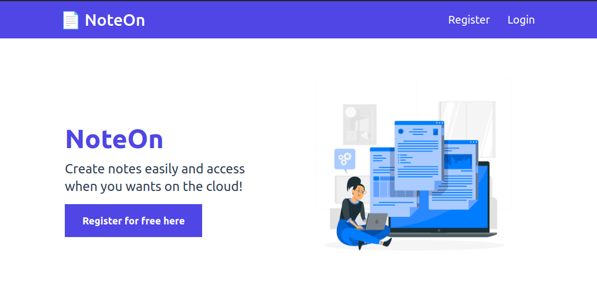
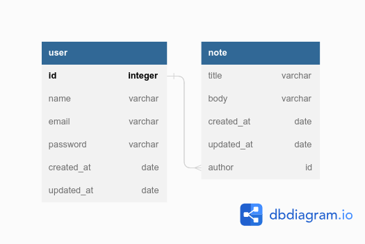

<h1 align="center"> 📄 NoteOn</h1>
<br>

<a href="" target="_blank">
<h2  align="center" >Veja a aplicação no ar 🚀 </h2>
</a>



<br>
<!-- <video src='video1.mov' width=180/> | <video src='video2.mp4' width=180/> -->

<iframe src="https://drive.google.com/file/d/1bExAtbJurXsJXCl6qRar5AvRDlcKbaqU/preview" width="640" height="300"></iframe>

<h3>
Tenha suas anotações importantes à mão, faça seu registro na plataforma, adicione suas ideias, tarefas com mais facilidade, aumente sua produtividade no dia-a-dia :D 
</h3>
<hr>
<br>

### ⚠️ Status do Projeto [■■■■■■■■□□] 80% 
- Refatorar estilo e responsividade das páginas
- Deploy backend e frontend

<br>

### 🔵 Documentação dos endpoints - Postman: [clique aqui](https://documenter.getpostman.com/view/14145764/2s93sc6D8v)
<br>

### 🔵 Sobre o projeto:
- Permite usuario se registrar e logar na plataforma.
- Permite que usuario crie, edite e exclua suas anotações.
- Permite que usuario edite seus dados pessoais e senha.
- Permite exclusão total da conta no NoteOn.

<br>

### 🔵 Tecnologias utilizadas:

#### backend: 
- [Express](https://expressjs.com/)
- [MongoDb](https://www.mongodb.com/)
- [NodeJS](https://nodejs.org/)
- [Nodemon](https://nodemon.io/)
- [Mongoose](https://mongoosejs.com/)
- [bcrypt](https://www.npmjs.com/package/bcrypt)
- [cors](https://www.npmjs.com/package/cors)
- [postman](https://www.postman.com/)
- [vscode](https://code.visualstudio.com/)

#### frontend:

- [ViteJS](https://vitejs.dev/)
- [ReactJS](https://reactjs.org/)
- [react-router-dom](https://reactrouter.com/en/main)
- [axios](https://axios-http.com/docs/intro)
- [moment](https://momentjs.com/)
- [fontawesome](https://fontawesome.com/)
- [postman](https://www.postman.com/)
- [vscode](https://code.visualstudio.com/)
- [tailwindcss](https://tailwindcss.com/)

<br>

### 🔵 Diagrama do banco de dados:



<br>

### 🔵 Como rodar:

1. Clonar o projeto: 
```
git clone https://github.com/MonicaMarcal/NoteOn.git
```
4. Em javascript_note_api no arquivo (.env ):
```
JWT_TOKEN=coloque_uma_senha
```

3. Na pasta javascript_note: 
```
npm install
npm run dev

```
4. Na pasta javascript_note_api: 
```
npm install
PORT=3001 npm start
```


<br>

### 🔵 Atribuições de imagens:
- <a href="https://br.freepik.com/vetores-gratis/ilustracao-do-conceito-de-documento-online_13338131.htm#from_view=detail_author">Imagem de storyset</a> no Freepik

<br>

### 🔵 Contatos:

<div align="left">
  <a href = "mailto: monicamarcal93@gmail.com"></a>
  <a href="https://www.linkedin.com/in/monica-software/" target="_blank"></a>   
</div>
